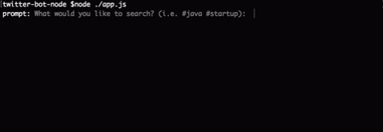

# Small Twitter Bot

A small Node.js app to perform interactions on the [Twitter REST API](https://dev.twitter.com/rest/public)

Currently, only searches Twitter and favorites the tweets that are found

---
##  Preview

---
## Getting Started
First, take a look at [Build a simple Twitter Bot with Node.js in just 38 lines of code](https://codeburst.io/build-a-simple-twitter-bot-with-node-js-in-just-38-lines-of-code-ed92db9eb078)

---
## Install
1. Clone or download `https://github.com/lamccloskey/twitter-bot-node.git`
2. Enter folder `cd twitter-bot-node/`
3. Run `npm install`
4. Create a file called `.env` and populate the following variables
    * `TWITTER_CONSUMER_KEY`
    * `TWITTER_CONSUMER_SECRET`
    * `TWITTER_ACCESS_TOKEN_KEY`
    * `TWITTER_ACCESS_TOKEN_SECRET`
5. Run `node app.js`

---
Inspired by [bmorelli25/Twitter-Favorite-Bot](https://github.com/bmorelli25/Twitter-Favorite-Bot)